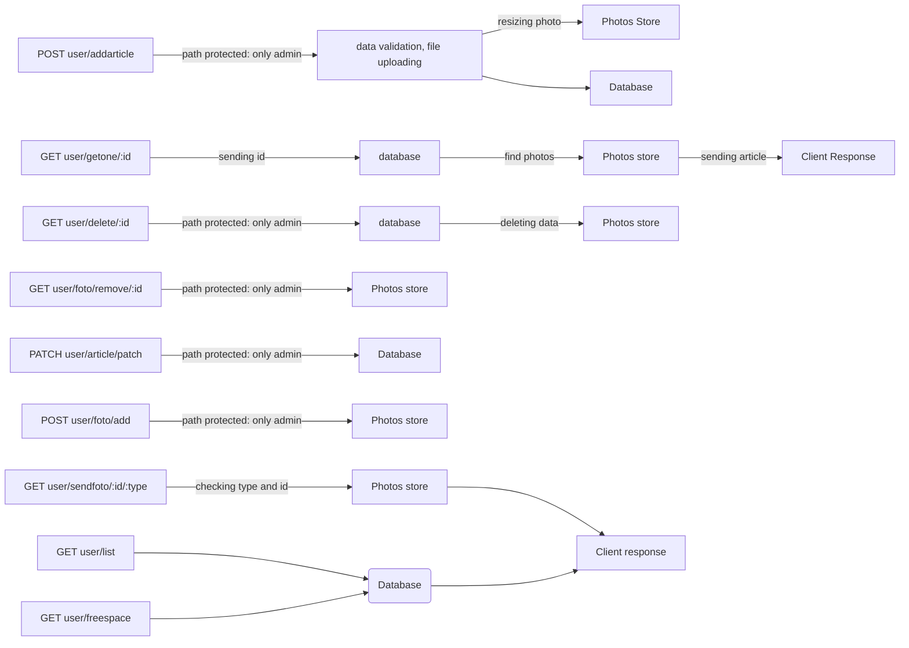
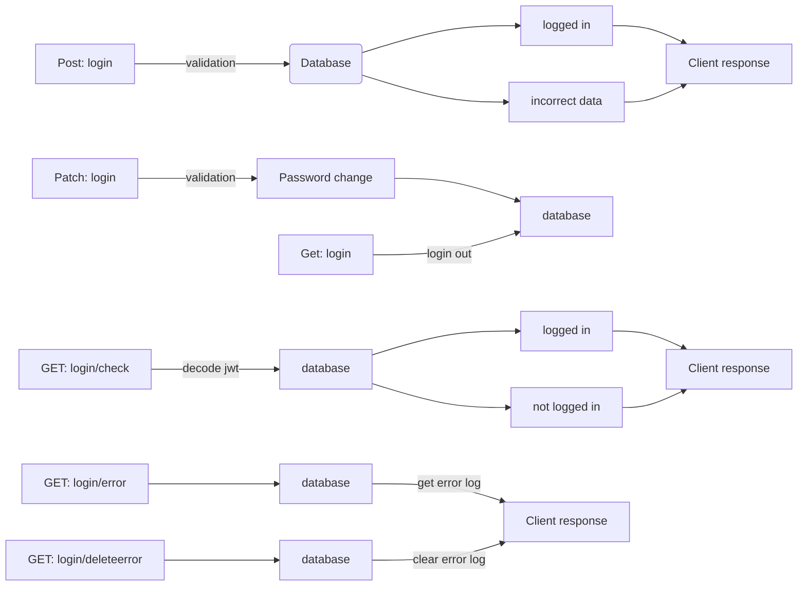

# My visit card service: Back-end

## Purpose

This application was made to handle request from front-end service part. Main tasks of this program are connection between front and database, data validation and admin login procedure. Program enables uploading and storing photos, and automatically preparing small size photos version for faster sending to front.

## Map of application

Endpoints for User module

Endpoints for Auth module

## How it`s work ?

Application is connected to SQL MariaDB database. All request and response from database are handled by typeorm. Login procedure is using json web token written in browser as http only cookie. admin password in database is hashed and coded with iv key and salt. Program let to login only on one device. After login admin have access to content manage panel and he can use protected endpoints paths. It is possible to upload 6 photos to each article. Every photo is automatically resize and convert to format .webp. All articles can be edited, photos can be attached, remove or download. Admin also have access to error log. Application save all error appeared. All added articles are visible for visitors.

## Technologies stack

This App is build with Nest.js framework and written in TypeScript.

Additional modules:

- bcrypt

- rxjs

- sharp

- passport

- passport-jwt

- cookie parser

- mysql2

## How to start ?

Before starting the application, after repository cloning, you need to install node modules. To do that you some node package manager will be required. If you use npm tap on console:

- npm install

After package installing you need to change access database data for your own in ormConfig.ts
Also you can change safety data in cryptoConfig.ts:

    - password
    > string of characters used to code the data, should be long
    - algorithm
    > coding algorithm, for example 'aes-192-cbc'
    - iterations: 
    > coding iteration number 

To start developer server you need install globally nest.js:

- npm install -g @nestjs/cli

Starting developer server in watch mode:

- nest start --watch

Building production app:

- nest build

### Very important!

Before you build production version remember to change entities in ormConfig.ts

develop version

- entities: ['dist/**/**.entity{.ts,.js}']

production version

- entities: ['**/**.entity{.ts,.js}']

## Contact

If you want to reach me use my email number: pileckidariusz90@gmail.com

## Copyrights

All code in this repository is free to use for everyone
